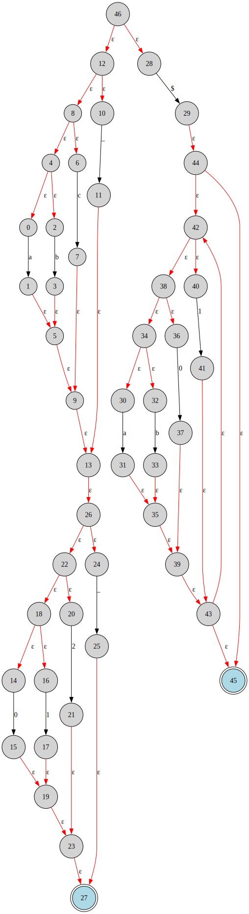
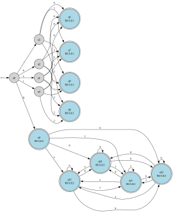
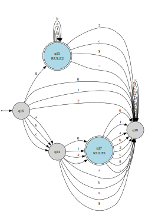

# Lexer

This package will implement the Lexer for Luma, rules defined in `regex_rules.txt` will be used to generate the state machines.
Each machine also comes with the `.dot` files to render a graphical representation.

Here is an example NFA machine generated from a few basic regex rules



Here is an example DFA machine generated from the same regex rules:



Here is an example DFA machine fully minimized WITH a sink state formed from the same regex rules:



Here is an output of the Lexer's current processing which will be piped to the next step of the Compiler. Code3.lm shows what a lexer error looks like (unidentified token)

```plaintext
Lexing file: /home/arqqm/luma/src/main/java/code1.lm
Token [lexeme=if, tokenTypes=[KEYWORD]]
Token [lexeme=aaaa, tokenTypes=[IDENTIFIER]]
Token [lexeme=if, tokenTypes=[KEYWORD]]
-----------
Lexing file: /home/arqqm/luma/src/main/java/code2.lm
Token [lexeme=if, tokenTypes=[KEYWORD]]
Token [lexeme=a, tokenTypes=[IDENTIFIER]]
Token [lexeme=aa, tokenTypes=[IDENTIFIER]]
Token [lexeme=aaa, tokenTypes=[IDENTIFIER]]
Token [lexeme=if, tokenTypes=[KEYWORD]]
Token [lexeme=a, tokenTypes=[IDENTIFIER]]
Token [lexeme=aaaa, tokenTypes=[IDENTIFIER]]
Token [lexeme=if, tokenTypes=[KEYWORD]]
Token [lexeme=aa, tokenTypes=[IDENTIFIER]]
Token [lexeme=aaa, tokenTypes=[IDENTIFIER]]
Token [lexeme=a, tokenTypes=[IDENTIFIER]]
Token [lexeme=if, tokenTypes=[KEYWORD]]
Token [lexeme=if, tokenTypes=[KEYWORD]]
Token [lexeme=aa, tokenTypes=[IDENTIFIER]]
Token [lexeme=aaaa, tokenTypes=[IDENTIFIER]]
Token [lexeme=a, tokenTypes=[IDENTIFIER]]
Token [lexeme=if, tokenTypes=[KEYWORD]]
Token [lexeme=a, tokenTypes=[IDENTIFIER]]
Token [lexeme=aa, tokenTypes=[IDENTIFIER]]
Token [lexeme=if, tokenTypes=[KEYWORD]]
Token [lexeme=aaaa, tokenTypes=[IDENTIFIER]]
Token [lexeme=if, tokenTypes=[KEYWORD]]
Token [lexeme=a, tokenTypes=[IDENTIFIER]]
-----------
Lexing file: /home/arqqm/luma/src/main/java/code3.lm
Lexer error at index 4: unexpected character '$'
Token [lexeme=if, tokenTypes=[KEYWORD]]
Token [lexeme=a, tokenTypes=[IDENTIFIER]]
Token [lexeme=aa, tokenTypes=[IDENTIFIER]]
Token [lexeme=if, tokenTypes=[KEYWORD]]
-----------
```

Current Todos:

- [x] Postfix Regex to NFA
- [x] Concat all NFAs
- [x] NFA to DFA
- [x] DFA Minimization
- [ ] Clean up and refactoring
- [ ] Infix to Postfix Regex
