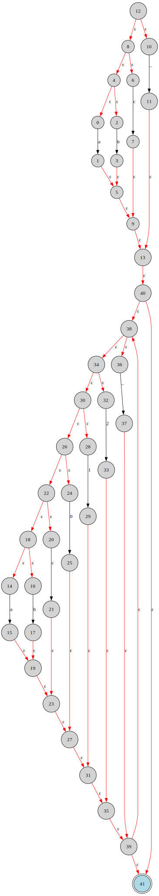

# Lexer

This package will implement the Lexer for Luma, rules defined in `regex_rules.txt` will be used to generate the state machines.
Each machine also comes with the `.dot` files to render a graphical representation.

Here is an example generated from the identifier NFA machine: 

Current Todos:

- [x] Postfix Regex to NFA
- [] Concat all NFAs
- [] NFA to DFA
- [] DFA Minimization
- [] Infix to Postfix Regex
